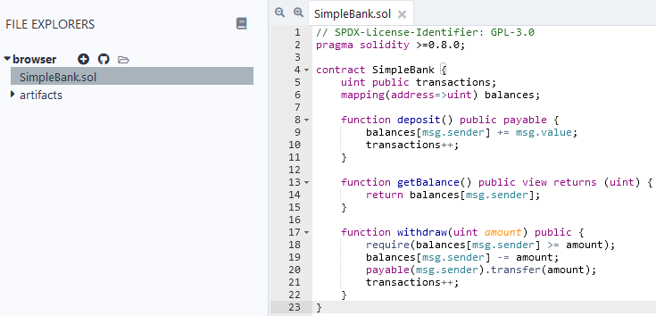
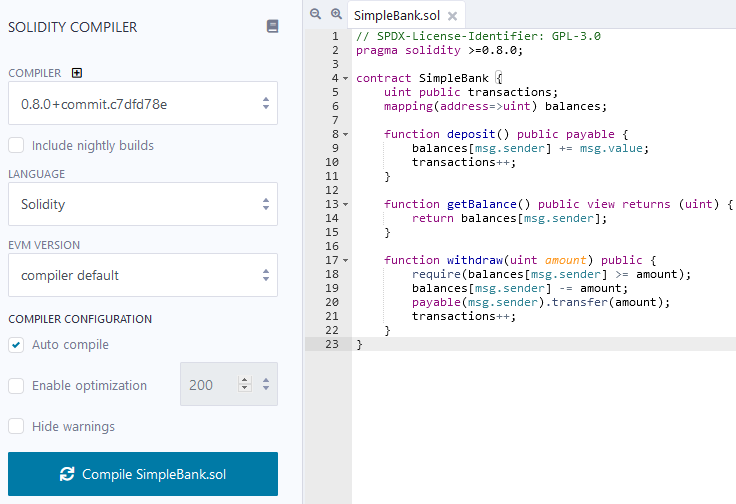
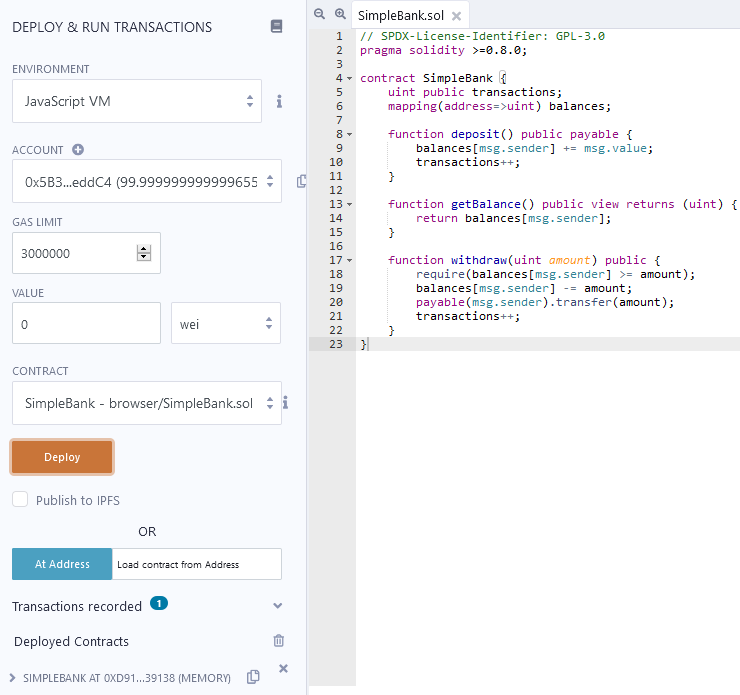
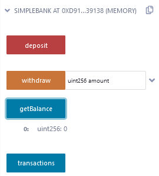
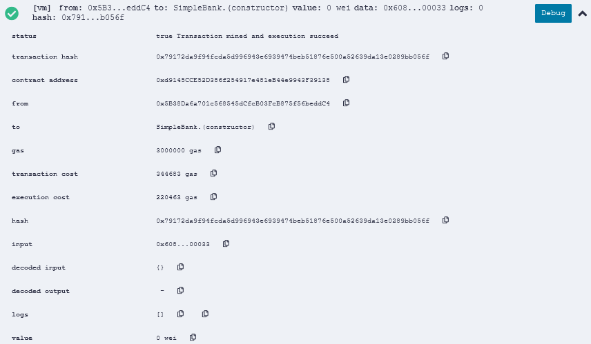

This is a supplementary guide for the [Blockchain Technologies and Applications (VIMIAV17)](https://www.mit.bme.hu/oktatas/targyak/vimiav17) course at the [Budapest University of Technology and Economics](http://www.bme.hu/?language=en).
The purpose of this document is to give a brief introduction into developing smart contracts for the Ethereum blockchain using the Solidity language.
For more information, please follow the links in the document.

## Ethereum Basics

[Ethereum](https://www.ethereum.org/) is a generic blockchain-based computing platform where nodes in a peer-to-peer network are maintaining the ledger.
Nodes run the [_Ethereum Virtual Machine (EVM)_](https://ethereum.github.io/yellowpaper/paper.pdf) and execute _transactions_ and _contracts_ compiled into EVM bytecode.
The main entities on the network are the _accounts_, identified by their 160-bit _addresses_.
There are two kinds of accounts.
- An _externally owned account_ is associated with a balance in Ether, the native cryptocurrency of Ethereum. It is typically owned by human users (via public/private keypairs).
- A _contract account_, in addition to its balance also stores the compiled contract bytecode and the data (state) associated with the contract.

Contracts are usually written in a high-level language (such as [Solidity](https://solidity.readthedocs.io/en/latest/)) and then compiled into EVM bytecode.
A compiled contract can be deployed to the blockchain by a special deployment transaction.
From that point on, users or other contracts can interact with the deployed contract by issuing _transactions_ to its address.
The transaction contains the function to be called (with its parameters) and an execution fee called _gas_.
Optionally, some value of Ether (the native cryptocurrency of the Ethereum platform) can also be associated with the call.
The nodes then execute the transaction by running the contract code.
The execuation of each instruction costs some predefined amount of gas based on the type of the operation.
For example, writing data to the state is more expensive than performing arithmetic computation.
If execution runs out of gas or there is a runtime error, the whole transaction is reverted.
Otherwise, successful transactions will be included in some of the next blocks as part of the mining process.

For more information and details, you can read the [How does Ethereum work, anyway? article](https://medium.com/@preethikasireddy/how-does-ethereum-work-anyway-22d1df506369) or the [Ethereum yellow paper](https://ethereum.github.io/yellowpaper/paper.pdf).

## Solidity Basics

Solidity is a rapidly evolving language, but it has a well written and extensive [documentation](https://docs.soliditylang.org/en/v0.8.0/).
The current guide is based on version 0.8.0 (released on December 16, 2020), but the latest documentation is available at [solidity.readthedocs.io/en/latest](https://docs.soliditylang.org/en/latest/).
Since this document only presents the basics, most of the concepts are the same, or very similar in older versions of Solidity.
However, there were important breaking changes related to safety and security of contracts, so always be aware of the specifics of the targeted version.
Sometimes, the same code is syntactically valid in older versions, but might behave differently (see for example, [overflows](https://docs.soliditylang.org/en/v0.8.0/080-breaking-changes.html#silent-changes-of-the-semantics)).

### Layout of Source Files

As in most programming languages, code is organized into one or more _source files_.
An example Solidity smart contract can be seen below.
The contract implements a simple bank, where users can deposit and withdraw money (Ether).
Furthermore, the bank also counts the number of transactions (i.e., each deposit and withdrawal).

Source files are recommended to include a [_license identifier_](https://docs.soliditylang.org/en/v0.8.0/layout-of-source-files.html#spdx-license-identifier) as a special comment.
The actual code starts with a [_pragma_](https://docs.soliditylang.org/en/v0.8.0/layout-of-source-files.html#pragmas) statement describing the _compiler version_ to use.
In this example, at least 0.8.0 is required (lower bound), but it is also possible to define upper bounds on the version.
A source file can then define multiple [_contracts_](https://docs.soliditylang.org/en/v0.8.0/contracts.html).
The example below has a single contract named `SimpleBank`.
The two most important components that a contract can define, are
- [_state variables_](https://docs.soliditylang.org/en/v0.8.0/structure-of-a-contract.html#state-variables), which define the persistent data stored on the blockchain and
- [_functions_](https://docs.soliditylang.org/en/v0.8.0/structure-of-a-contract.html#functions) that can be called as part of transactions, and can manipulate the data and interact with other accounts.

```solidity
// SPDX-License-Identifier: GPL-3.0
pragma solidity >=0.8.0;

contract SimpleBank {
    uint public transactions;
    mapping(address=>uint) balances;

    function deposit() public payable {
        balances[msg.sender] += msg.value;
        transactions++;
    }

    function getBalance() public view returns (uint) {
        return balances[msg.sender];
    }

    function withdraw(uint amount) public {
        require(balances[msg.sender] >= amount);
        balances[msg.sender] -= amount;
        payable(msg.sender).transfer(amount);
        transactions++;
    }
}
```

At a first glance, smart contracts resemble simple classes in object-oriented programming, however, there are important differences (e.g., the transactional execution of functions).

It is also possible to [_import_](https://docs.soliditylang.org/en/v0.8.0/layout-of-source-files.html#importing-other-source-files) other source files and Solidity also supports [_inheritance_](https://docs.soliditylang.org/en/v0.8.0/contracts.html#inheritance) between contracts.

### State Variables

The SimpleBank example defines two state variables.
- `transactions` is an unsigned integer (`uint`), storing the number of transactions in the current bank instance. It is incremented whenever users succesfully deposit or withdraw.
- `balances` is a _mapping_ from addresses to integers, storing the current balance of each user. Mappings work similarly to maps in Java/C++ or dictionaries in C#/Python, i.e., they associate keys to values.

Solidity is a strongly-typed language, i.e., the type of each variable must be explicitly specified.

**Value types.** Solidity offers various [_value types_](https://docs.soliditylang.org/en/v0.8.0/types.html#value-types), including:
- Booleans (`bool`) with `true` and `false`.
- Signed and unsigned integers of various bit-sizes: `int8`, `int16`, `int24`, ..., `int248`, `int256` are signed and `uint8`, `uint16`, `uint24`, ..., `uint248`, `uint256` are unsigned integers with 8, 16, 24, ..., 248, 256 bits. The default `int` and `uint` types correspond to `int256` and `uint256` respectively.
- Addresses (`address`) are 160-bit integers corresponding to Ethereum addresses.
- Enumerations.

**Remark.**
Since 0.8.0, if an arithmetic operation causes an under- or overflow, it is by default, treated as an error and the transaction is reverted.
However, before 0.8.0, arithmetic operations had a wraparound semantics, resulting in silent under- and overflows.
For example, `127 + 1` resulted in `-128` on 8 (signed) bits.
This caused many bugs and problems, so since 0.8.0 the default behavior is to trigger an error in case of an under- or overflow.
The old, wraparound behavior can be achieved by wrapping the arithmetic operation into an `unchecked { ... }` block.
However, use this with caution.
For example,
```solidity
int8 x = 127;
int8 y = 1;
int8 z = x + y;
```
results in a reverted transaction since 0.8.0, and results in `z` silently overflowing to `-128` before 0.8.0.
However,
```solidity
int8 x = 127;
int8 y = 1;
unchecked {
    int8 z = x + y;
}
```
results in `z` being `-128` in 0.8.0 as well.

**Reference types.**
Solidity also provides [_reference types_](https://docs.soliditylang.org/en/v0.8.0/types.html#reference-types), including:
- Arrays (with fixed or dynamic size), including strings.
- Structures (`struct`).
- Mappings (`mapping(...=>...)`).

These types work mostly in a similar way as in other programming languages.
However, reference types can reside in different [data locations](https://docs.soliditylang.org/en/v0.8.0/types.html#data-location), such as the permanent contract `storage` (stored on the blockchain) or in a transient `memory` (during executing a transaction).
The behavior of allocations and assignments can be different for these data locations (e.g., assignments between storage entities do a deep copy, while in memory it is just reference assignment) so pay special attention.
For more information on types, see the [types section of the documentation](https://docs.soliditylang.org/en/v0.8.0/types.html#data-location) or an [article formalizing the memory model](https://arxiv.org/pdf/2001.03256.pdf).

**Visibility.** State variable [visibility](https://docs.soliditylang.org/en/v0.8.0/contracts.html#visibility-and-getters) can be `private`, `internal` or `public`, which are similar to other programming languages.
However, there are a few remarkable differences.
- For public variables, only a getter function is generated automatically. They can be read, but cannot be directly written by other contracts or transactions.
- Although private (and internal) variables cannot be accessed and modified by other contracts, transactions on the blockchain are public, so the information stored in such variables is still visible to anyone. Never store passwords or other secret information directly in state variables.
- If no visibility is specified, `internal` is the default.

### Functions

[Functions](https://docs.soliditylang.org/en/v0.8.0/contracts.html#functions) in Solidity can read and manipulate the state variables and interact with other contracts and accounts.
Functions can have parameters (e.g., `withdraw` in the example has one parameter) and can return values (e.g., `getBalance` returns one).
The SimpleBank example specifies three functions.
- The `deposit` function is `public` (can be called by anyone) and `payable`, which means that it can receive Ether as part of the call.
Functions can access a special `msg` field, which stores information about the function call.
For example, the `deposit` function reads the amount of Ether associated with the call from the `msg.value` field and increases the balance of the caller, whose address is stored in `msg.sender`.
It can also be seen that the dictionary can be accessed using square brackets (`balances[msg.sender]`).
Finally, the function increments the `transactions` counter.
- The function `getBalance` is marked as `view`, which means that it does not modify the state of the contract, but it can still read it.
The `pure` keyword (instead of `view`) is even more restrictive: `pure` functions cannot read or write the state.
The function also specifies a return value with `returns (...)`.
This function gets and returns the balance of the caller (`msg.sender`).
- The function `withdraw` specifies a single `uint` parameter called `amount`, corresponding to the amount that the caller wants to withdraw from the bank.
The function first checks whether the caller has enough Ether in the bank using a `require` statement.
The `require` statement checks the condition and reverts the whole transaction if the condition is false.
Otherwise it updates the mapping by decreasing the balance of the caller and then transfers the required amount using the `transfer` function.
Note that `msg.sender` is of type `address`, which first has to be converted to `address payable` using `payable(...)` (see later).
Finally, the function increments the `transactions` counter.

Besides the basic statements illustrated by the SimpleBank example, functions can have [other statements](https://docs.soliditylang.org/en/v0.8.0/control-structures.html) such as selection (`if-else`) or loops (`for`, `while`).
However, as execution costs a transaction fee per instruction (gas), it is recommended to avoid complex operations like loops when possible.
Furthermore, instructions writing the blockchain state are more expensive to execute, therefore it is also recommended to minimize the number of writes.

**Special variables and functions.** As already mentioned in the example, functions can access a special `msg` field, which stores information about the function call.
Besides `msg`, functions can also access some other special variables and functions, including for example the parameters of the current transaction (`tx`) and block (`block`), or the remaining gas (`gasleft()`).
For more information, see the [special variables and functions section of the documentation](https://docs.soliditylang.org/en/v0.8.0/units-and-global-variables.html#special-variables-and-functions).
Use these special variables and functions with caution as they may introduce vulnerabilities to your contract.
For example, `tx.origin` [should never be used for authorization](https://docs.soliditylang.org/en/v0.8.0/security-considerations.html#tx-origin), use `msg.sender` instead.

**Visibility.** Functions must be marked with a `public`, `internal`, `private` or `external` visibility.
For more information, see the [visibility section of the documentation](https://docs.soliditylang.org/en/v0.8.0/contracts.html#visibility-and-getters).
Before 0.5.0, if a function did not specify a visibility it was public by default.
However, this lead to vulnerabilities and in the current version the visibility must be explicitly specified.

**Constructor.** State variables are initialized to their default values (e.g., `0` for integer types or an empty mapping).
However, an explicit [constructor](https://docs.soliditylang.org/en/v0.8.0/contracts.html#constructors) (at most one) can be provided (including parameters) with the `constructor` keyword.
For example, one could write a constructor for the SimpleBank example, which starts the transaction counter from a given parameter.

```solidity
contract SimpleBank {
    // ...
    constructor(uint start) {
        transactions = start;
    }
}
```

Since 0.7.0 the constructor is always public.
In order to prohibit instantiating a contract, it should be marked `abstract`.

**Function modifiers.**
[Function modifiers](https://docs.soliditylang.org/en/v0.8.0/contracts.html#function-modifiers) can change the behavior of functions.
They are most commonly used to perform checks before or after executing the body of the function, especially if multiple functions require the same check.

The example below declares an `owner` state variable, which stores the creator of the contract (see constructor).
Then, a modifier called `onlyOwner` is defined, which checks if the sender equals to the owner.
Then, it executes the rest of the function, which is denoted by the special _placeholder_ statement `_`.
The `increment` function has the `onlyOwner` modifier, which means that instead of executing `x++`, it first jumps to the modifier, which performs the check and then does the increment at the placeholder statement.
Note that it is also possible to put statements after the placeholder `_`, these will be executed at the end of the function.
This is the most basic way of using modifiers, but it is really useful when multiple functions share some common checks.
```solidity
contract ModifierExample {
    address owner;
    uint x;

    constructor() {
        owner = msg.sender;
    }
    
    modifier onlyOwner {
        require(msg.sender == owner);
        _;
    }
    
    function increment() public onlyOwner {
        x++;
    }
}
```

### Handling Ether

Each [address](https://docs.soliditylang.org/en/v0.8.0/units-and-global-variables.html#members-of-address-types) (contract or external) is associated with a balance in Ether.
Solidity provides various language features to query balances and transfer Ether.
The `address` type has a field `balance` which can query the balance.
For example, to query the balance of the current contract inside a function we can use `address(this).balance`:
```solidity
function getContractBalance() public returns (uint) {
    return address(this).balance;
}
```

There is another [flavour](https://docs.soliditylang.org/en/v0.8.0/types.html#address) of the `address` type called `address payable`, which is a special address that can receive Ether (similarly to `payable` functions).
An `address` can be converted to `address payable` by the function `payable(...)`.
A payable address has two functions to transfer Ether: `transfer` and `send`.
The difference between the two is that in case of a failure, `transfer` propagetes the failure, causing a failure in the caller as well.
In contrast, `send` indicates failure with a `false` return value.
In the SimpleBank example, we use `transfer` in the `withdraw` function because if it fails, the failure is propagated to the `withdraw` function itself and the whole transaction is reverted (including the instruction that decreased the balance of the caller).
If using `send` instead, we would have to manually check its return value and revert the transaction (using an explicit `revert()`) if needed.
It is a [typical programming error](https://docs.soliditylang.org/en/v0.8.0/security-considerations.html#sending-and-receiving-ether) to use `send` without checking its return value.
For example,
```solidity
payable(msg.sender).transfer(amount);
```
or
```solidity
if (!payable(msg.sender).send(amount)) revert();
```
are correct, but
```solidity
payable(msg.sender).send(amount);
```
is wrong, as the result of `send` is ignored.

As already seen in the SimpleBank example, functions can be marked with the `payable` keyword, allowing the caller to attach Ether to the call.
The Ether attached is automatically added to the balance of the contract, but can also be queried from the `msg.value` field.
When a contract wants to call another contract and send Ether, it can set the amount with the special `value` syntax in curly brackets.
For example, if we have a `SimpleBank sb` field in another contract, we can call `sb.deposit{value: amount}()` to deposit a given amount.
Note that the curly brackets must come between the function name and its parameter list.

**Fallback function.**
Each contract can define a special [_fallback function_](https://docs.soliditylang.org/en/v0.8.0/contracts.html#fallback-function).
This function gets executed when a call to the contract matches no other functions.
Note that the fallback function must be `external`, and can also be marked `payable` in order to be able to receive Ether.
An example fallback function can be seen below.
```solidity
fallback() external payable {
    // Do something
}
```
It is important to be aware of this behavior, because when calling some function or sending Ether to an arbitrary address, we might actually transfer the control flow, letting the callee execute its own code (see [reentrancy vulnerability](https://docs.soliditylang.org/en/v0.8.0/security-considerations.html#re-entrancy)).

**Receive function.**
Each contract can define a special [_receive Ether function_](https://docs.soliditylang.org/en/v0.8.0/contracts.html#receive-ether-function).
This function gets executed when a contract receives Ether without calling any particular function (e.g., by using `transfer()` on its address).
```solidity
receive() external payable {
    // Do something
}
```

**Remark.** Before 0.6.0, there was a single function with no name, that represented both the fallback and the receive Ether functions.

**Ether units.** There is no distinct type for Ether, unsigned integers are used.
The default unit is Wei, but literals can be specified using [suffixes](https://docs.soliditylang.org/en/v0.8.0/units-and-global-variables.html#ether-units) such as `wei`, `gwei` (== 1e9 Wei) or `ether` (== 1e18 Wei).
For example, `uint amount = 1 ether;` will store `10^18` in the variable `amount`.

### Error Handling

Transactions in Ethereum work in an atomic way: if there is an error, the whole transaction gets reverted.
Errors can happen due to some condition in the execution, such as running out of the execution fee or indexing an array out of bounds.
However, there are multiple ways for the programmer to [raise an error](https://docs.soliditylang.org/en/v0.8.0/control-structures.html#error-handling-assert-require-revert-and-exceptions).
These functions also allow to specify error messages, which makes interpreting failing transactions easier.
- `require(...)` checks if a condition holds and if not, it reverts the transaction. It is recommended to be used for example to validate parameters at the beginning of the function.
- `assert(...)` is similar to `require` in its effect, but it is recommended to use for checking conditions that should not fail. Proper code should never reach an assertion failure. In contrast, it is normal for `require` to raise an error.
- `revert()` simply reverts the transaction.

When functions call other functions, the errors propagate up, making the whole chain of calls revert.
However, there are a few exceptions from this rule: `send`, `call`, `delegatecall` and `staticcall` only indicate the error in their return value.
These functions should be used with caution.
Furthermore, since 0.6.0, the `try`/`catch` statement was introduced that can catch exceptions in external calls, stopping the propagation of exceptions.
See details in the [documentation](https://solidity.readthedocs.io/en/v0.8.0/control-structures.html#try-catch).

### More Examples

- [Counter](http://ftsrg.mit.bme.hu/blockchain-ethereumlab/contracts/Counter.sol): A very basic counter.
- [BmeCoin](http://ftsrg.mit.bme.hu/blockchain-ethereumlab/contracts/BmeCoin.sol): A simple token.
- [DNS](http://ftsrg.mit.bme.hu/blockchain-ethereumlab/contracts/DNS.sol): Domain name registration service.

### Further Reading

Solidity supports some other language elements that were not discussed here, including [events](https://docs.soliditylang.org/en/v0.8.0/contracts.html#events), [inheritance](https://docs.soliditylang.org/en/v0.8.0/contracts.html#inheritance), [interfaces](https://docs.soliditylang.org/en/v0.8.0/contracts.html#interfaces) and [libraries](https://docs.soliditylang.org/en/v0.8.0/contracts.html#libraries).
Solidity 0.6.0 also introduced exception handling using [try/catch](https://solidity.readthedocs.io/en/v0.8.0/control-structures.html#try-catch).
For more information, please refer to the [documentation](https://docs.soliditylang.org/en/v0.8.0/).

For the latest news, read the [Ethereum blog](https://blog.ethereum.org/).
You can also check out the source code of the compiler on [GitHub](https://github.com/ethereum/solidity).

While it may seem easy to develop Solidity code, it is also easy to make mistakes.
Since the Ethereum blockchain is public, anyone can exploit such bugs, causing serious financial damages (e.g., [reentrancy in the DAO](https://medium.com/swlh/the-story-of-the-dao-its-history-and-consequences-71e6a8a551ee) or [overflow in the BECToken](https://medium.com/@peckshield/alert-new-batchoverflow-bug-in-multiple-erc20-smart-contracts-cve-2018-10299-511067db6536)).
Furthermore, the blockchain is permanent so buggy contracts cannot be patched once deployed.
It is therefore highly recommended to read about [security considerations](https://docs.soliditylang.org/en/v0.8.0/security-considerations.html), [common attacks](https://medium.com/coinmonks/common-attacks-in-solidity-and-how-to-defend-against-them-9bc3994c7c18) and [best practices](https://consensys.github.io/smart-contract-best-practices/known_attacks/).
There is also a handful of tools targeting the verification of contracts, including [Truffle](https://truffleframework.com/), [Securify](https://github.com/eth-sri/securify2), [MythX](https://mythx.io/), [Slither](https://github.com/crytic/slither), [solc-verify](https://github.com/SRI-CSL/solidity/), [VerX](https://verx.ch/) and [VeriSol](https://github.com/microsoft/verisol).

## Development and Test Environments

As with other programming languages, development requires some tools.
At first, it is recommended to play around with [Remix](http://remix.ethereum.org), which is an online IDE.
It only requires a browser, and provides an editor and a built-in compiler.
Furthermore, it can also create a local test network where the contracts can be deployed and transactions can be issued on a GUI interactively.
Remix also has some further plug-ins for debugging, static analysis and so on.

In a local environment, [Visual Studio Code](http://code.visualstudio.com) has a [Solidity extension](https://marketplace.visualstudio.com/items?itemName=JuanBlanco.solidity) to edit Solidity contracts.
The official compiler is [Solc](https://docs.soliditylang.org/en/v0.8.0/installing-solidity.html), which can translate contracts into EVM bytecode.
For testing in a local environment, the [Truffle Suite](http://truffleframework.com) is recommended, which has extensive capabilities in writing and executing automated tests.
Note that Truffle also includes a compiler internally so installing Solc can be skipped in this case.

_For more complex contracts and scenarios, one should also consider other features of [Truffle Suite](http://truffleframework.com).
Finally, in order to deploy a contract to a real network one also needs a wallet such as [Metamask](https://github.com/MetaMask)._

### Remix

We cover the basics of [Remix](http://remix.ethereum.org), for more information, please refer to the [documentation of Remix](https://remix-ide.readthedocs.io/en/latest/).
_Hint:_ you can choose from different themes using the settings at the bottom left.

**Writing a contract.**
Remix has different modules, which can be accessed from the icons on the left.
Let's start with the [file explorers](https://remix-ide.readthedocs.io/en/latest/file_explorer.html).
You can create or import files in Remix with the icons on the top left (file explorers).
As an example, create a new file named `SimpleBank.sol` and copy the code from the SimpleBank example above.
The Remix [editor](https://remix-ide.readthedocs.io/en/latest/solidity_editor.html) supports syntax highlighting and auto completion as well.
Don't mind the `artifacts` folder, it appears automatically during compilation.



**Compiling a contract.**
In order to compile a contract, the [compiler plug-in](https://remix-ide.readthedocs.io/en/latest/compile.html) has to be activated (if it is not active yet) by clicking on the plug-in icon on the left sidebar and finding the _Solidity compiler_ plugin.
A new icon for the compiler should appear in the left sidebar, which activates the compiler tab.
Make sure to select an appropriate compiler version and click the _Compile_ button.
You can also turn on the _Auto compile_ option.
On a successful compilation, the contract name will appear below the button.
Warnings or errors also appear below.




**Testing a contract.**
For a simple local test, activate the  [Deploy & run transactions plug-in](https://remix-ide.readthedocs.io/en/latest/run.html).
The default _environment_ is JavaScript VM, which runs an Ethereum Virtual Machine (EVM) locally (i.e., it does not connect to the real network).
This makes testing quick and free.
Remix also supports connecting to a real network by selecting the Web3 option as an environment (which requires a wallet first).
Besides the main network, there are also some test networks ([Ropsten](https://ropsten.etherscan.io/), [RinkeBy](https://www.rinkeby.io), [Kovan](https://kovan.etherscan.io/)).
These networks are somewhat similar to the main network as there are multiple nodes and miners.
However, the Ether on these networks has no real value: you can also request some free Ether to test your contracts.

For the purpose of this tutorial we will be simply working with the local JavaScript VM environment.
Remix also creates some test _accounts_ by default with 100 Ether each.
The account currently selected is used as the sender when you issue transactions.
You can specify the _gas limit_ and you can also attach ether to the call with the _value_ field.



The first step is to deploy the contract.
This can be done by selecting the contract name from the drop down menu and then clicking _Deploy_.
The contract should appear below in the list of deployed contracts.
You can also see that the balance of the selected account decreased a bit.
This is because deploying a contract is a special transaction that also costs execution fee (gas).

If you click on the small arrow on the left of a deployed contract, its public interface appears.
Our example, `SimpleBank` has 4 functions.
You can see that `payable` and `view` functions are marked with a different color.
View functions do not result in transactions and therefore have no execution fee.
Click on a function to execute it.
If a function has parameters (such as `withdraw`), you can specify its parameters in the textboxes next to the name of the function.
After executing the function, the return value (if any) appears below.



You can also inspect the details of the transactions at the bottom (below the editor).
For example, you can see all the details of the deployment transaction on the image below.



You can now try playing around with `SimpleBank`.
For example, you can set the _value_ to 10 Ether and call `deposit`.
Then `getBalance` should return 10000000000000000000 (Wei).
Calling `transactions` should return 1.
If you switch to a different account and call `getBalance` you should see 0.
If you try to `withdraw`, the transaction should fail due to the `require`.
Switching back to the previous account, `withdraw` should work (for at most 10 Ether, of course).

If you make modifications to the contract, don't forget to compile and deploy again!
You can also take a look at other plug-ins, such as the [Solidity static analysis](https://remix-ide.readthedocs.io/en/latest/static_analysis.html), the [Solidity unit testing](https://remix-ide.readthedocs.io/en/latest/unittesting.html) or the [Debugger](https://remix-ide.readthedocs.io/en/latest/debugger.html).

### Local Testing with Truffle

[Truffle](https://www.trufflesuite.com) is a development suite for Ethereum, providing various tools, including compilation, linking, binary management, testing, deployment, network management, package management, interactive console and configurable build pipeline.
In the following we demonstrate the unit testing capabilities of Truffle with a simple example.
For more information, please refer to the [documentation of Truffle](https://www.trufflesuite.com/docs/truffle/overview), including [installation](https://www.trufflesuite.com/docs/truffle/getting-started/installation).

**Creating a project.**
Create and initialize a new, default Truffle project.
This will initialize the directory structure and create some skeleton files.
```bash
mkdir SimpleBankTest
cd SimpleBankTest
truffle init
```

Put the `SimpleBank` example from above into `contracts/SimpleBank.sol`.

Create a file `migrations/2_deploy_contracts.js` with the following content.
```javascript
var SimpleBank = artifacts.require("./SimpleBank.sol");
module.exports = function(deployer) {
  deployer.deploy(SimpleBank);
};
```
Migrations are JavaScript files that deploy contracts to the (test) network.

**Writing tests.**
Create a test file `test/SimpleBank.js` with the following content.
```javascript
var SimpleBank = artifacts.require("SimpleBank");

contract('SimpleBank', function(accounts) {
    var sb; // To store the instance when running

    // Test case 1
    it("Test initial balance", function() {
        return SimpleBank.deployed().then(function(instance) {
            sb = instance;
            return sb.getBalance({ from: accounts[0] });
        }).then(function(x) {
            assert.equal(0, x, "Wrong initial balance");
        });
    });

    // Test case 2
    it("Test balance after deposit", function() {
        return SimpleBank.deployed().then(function(instance) {
            sb = instance;
            return sb.deposit({ from: accounts[0], value: web3.utils.toWei('10', 'ether') });
        }).then(function(tx_receipt) {
            return sb.getBalance({ from: accounts[0] });
        }).then(function(x) {
            assert.equal(web3.utils.toWei('10', 'ether'), x, "Wrong balance");
        }).then(function() {
            return sb.getBalance({ from: accounts[1] });
        }).then(function(x) {
            assert.equal(0, x, "Wrong balance");
        });
    });
});
```
The first test case creates a contract and checks if the initial balance of account 0 is zero.
The second test case makes a deposit from account 0, and checks if the balance is modified appropriately.
It also checks that the balance of account 1 should still be zero.

**Executing tests.**
Tests can be run with the following command.
This will launch a local, built-in blockchain, deploy the contract and run the tests.
```
truffle test
```

If Truffle is complaining about wrong compiler version, open `truffle-config.js` at the root of the project, scroll down to `solc` and set the `version` attribute to `0.8.0` (also uncomment if needed).

The output should look like the following, with all tests successfully passing.
```
Compiling your contracts...
===========================
Fetching solc version list from solc-bin. Attempt #1
Downloading compiler. Attempt #1.
> Compiling ./contracts/Migrations.sol
> Compiling ./contracts/SimpleBank.sol
> Artifacts written to /tmp/test--4464-ffkygXpC3oCc
> Compiled successfully using:
   - solc: 0.8.0+commit.c7dfd78e.Emscripten.clang


  Contract: SimpleBank
    Test initial balance (86ms)
    Test balance after deposit (649ms)


  2 passing (901ms)
```

In this example we wrote unit tests using [JavaScript](https://www.trufflesuite.com/docs/truffle/testing/writing-tests-in-javascript), but it is also possible to use [Solidity itself](https://www.trufflesuite.com/docs/truffle/testing/writing-tests-in-solidity).
For more information please refer to the [documentation of Truffle](https://www.trufflesuite.com/docs/truffle/overview).
