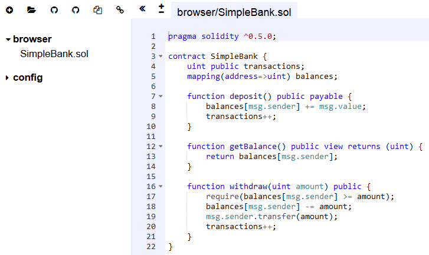
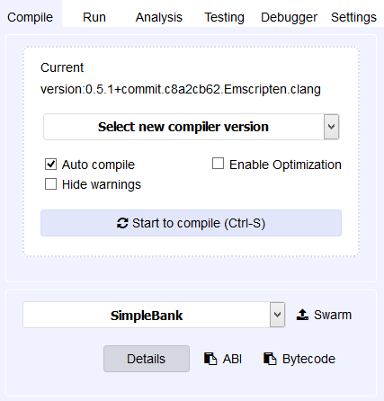
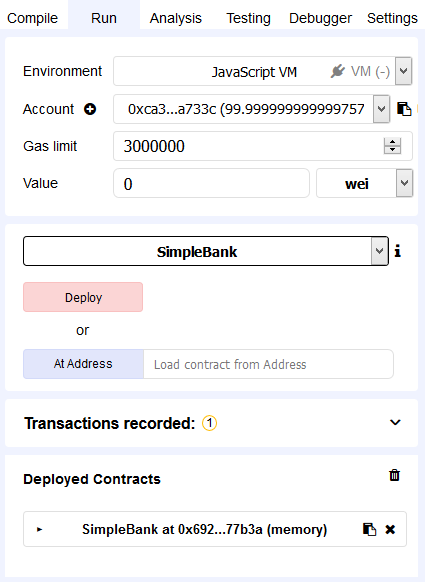
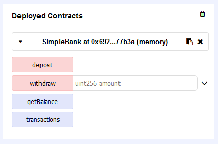
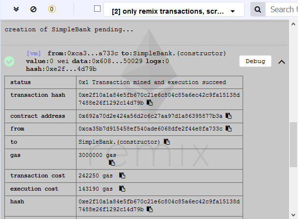

# Solidity/Ethereum development quick guide

This is a supplementary guide for the [Blockchain Technologies and Applications (VIMIAV17)](http://inf.mit.bme.hu/edu/courses/blockchain/) course at the [
Budapest University of Technology and Economics](http://www.bme.hu/?language=en).

## Ethereum basics

Ethereum is a generic blockchain-based computing platform where nodes in a peer-to-peer network are maintaining the ledger.
Nodes run the _Ethereum Virtual Machine (EVM)_ and execute transactions and contracts compiled into EVM bytecode.
The main entities on the network are the _accounts_, identified by their 160-bit addresses.
There are two kinds of accounts.
- An _externally owned account_ is associated with a balance in Ether, the native cryptocurrency of Ethereum. It is typically owned by human users.
- A _contract account_, in addition to its balance also stores the compiled contract bytecode and the data associated with the contract.

Contracts are usually written in a high-level language (such as Solidity) and then compiled into EVM bytecode.
A compiled contract can be deployed to the blockchain by a special transaction.
From that point on, users or other contracts can interact with the deployed contract by issuing _transactions_.
The transaction contains the function to be called (with its parameters) and an execution fee called _gas_.
Optionally, some value of Ether can also be associated with the call.
The nodes then execute the transaction by running the contract code.
Each instruction costs some predefined amount of gas.
If execution runs out of gas, the whole transaction is reverted.
Otherwise, successful transactions will be included in some of the next blocks as part of the mining process.

## Solidity basics

Solidity is a rapidly evolving language, but it has a well written and extensive [documentation](https://solidity.readthedocs.io/en/v0.5.0/).
The current guide is based on version 0.5.0 (released on November 13, 2018), but the latest documentation is available at [solidity.readthedocs.io/en/latest](https://solidity.readthedocs.io/en/latest/).

### Layout of source files

An example Solidity smart contract (implementing a simple bank) can be seen below.
Source files start with a [_pragma_](https://solidity.readthedocs.io/en/v0.5.0/layout-of-source-files.html#pragmas) statement describing the _compiler version_ to use.
A source file can then define multiple _contracts_.
The example below has a single contract named `SimpleBank`.

At a first glance, smart contracts are similar to simple classes in object-oriented programming. Contracts can define
- [_state variables_](https://solidity.readthedocs.io/en/v0.5.0/structure-of-a-contract.html#state-variables), which define the data stored on the blockchain and
- [_functions_](https://solidity.readthedocs.io/en/v0.5.0/structure-of-a-contract.html#functions) that can manipulate the data and interact with other accounts.


It is also possible to [_import_](https://solidity.readthedocs.io/en/v0.5.0/layout-of-source-files.html#importing-other-source-files) other contracts from other source files and Solidity also supports [_inheritance_](https://solidity.readthedocs.io/en/v0.5.0/contracts.html#inheritance) between contracts.

```
pragma solidity ^0.5.0;

contract SimpleBank {
    uint public transactions;
    mapping(address=>uint) balances;

    function deposit() public payable {
        balances[msg.sender] += msg.value;
        transactions++;
    }

    function getBalance() public view returns (uint) {
        return balances[msg.sender];
    }

    function withdraw(uint amount) public {
        require(balances[msg.sender] >= amount);
        balances[msg.sender] -= amount;
        msg.sender.transfer(amount);
        transactions++;
    }
}
```

### State variables

The SimpleBank example defines two state variables.
- `transactions` is an unsigned integer (`uint`), storing the number of transactions in the current bank instance.
- `balances` is a _mapping_ from addresses to integers, storing the balance of each user. Mappings work similarly to maps in Java/C++ or dictionaries in C#/Python.

#### Types

Solidity is a strongly-typed language, i.e., the type of each variable must be explicitly specified.
Solidity includes various [_primitive types_](https://solidity.readthedocs.io/en/v0.5.0/types.html#value-types), including:
- Booleans (true/false).
- Signed and unsigned integers of various bit-lengths: `int8`, `int16`, `int24`, ..., `int256` are signed and `uint8`, `uint16`, `uint24`, ..., `uint256` are unsigned integers with 8, 16, 24, ..., 256 bit-lengths. The default `int` and `uint` types correspond to `int256` and `uint256` respectively.
- Addresses (`address`) are 160-bit integers corresponding to Ethereum addresses.

Solidity also provides [_reference types_](https://solidity.readthedocs.io/en/v0.5.0/types.html#reference-types), including:
- Arrays (with fixed or dynamic size).
- Structures (`struct`).
- Mappings (`mapping(...=>...)`).

These work in a similar way as in other programming languages.
For more information on types, see [types section of the documentation](https://solidity.readthedocs.io/en/v0.5.0/types.html).

#### Visibilities

State variable [visibility](https://solidity.readthedocs.io/en/v0.5.0/contracts.html#visibility-and-getters) can be `private`, `internal` or `public`, which are similar to other programming languages.
However, there are a few remarkable differences.
- For public variables only a getter function is generated automatically. They cannot be directly written by other contracts or transactions.
- Although private (and internal) variables cannot be accessed and modified by other contracts, transactions on the blockchain are public, so the information stored in such variables is still visible to anyone. Never store passwords or other secret information on the blockchain.

### Functions

[Functions](https://solidity.readthedocs.io/en/v0.5.0/contracts.html#functions) in Solidity can read and manipulate the state variables and interact with other contracts and accounts.
Functions can have parameters (e.g., `withdraw` in the example has one parameter) and can return values (e.g., `getBalance` returns one).
The SimpleBank example specifies three functions.
- The `deposit` function is `public` (can be called by anyone) and `payable`, which means that it can receive Ether as part of the call.
Functions can access a special `msg` field, which stores information about the function call.
For example, the `deposit` function reads the amount of Ether associated with the call from the `msg.value` field and increases the balance of the caller, whose address is stored in `msg.sender`.
It can also be seen that the dictionary can be accessed using square brackets (`balances[msg.sender]`).
Finally, the function increments the `transactions` counter.
- The function `getBalance` is marked as `view`, which means that it does not modify the state of the contract, but it can still read it.
The `pure` keyword (instead of `view`) is even more restrictive: such functions cannot read or write the state.
The function also specifies a return value with `returns (...)`.
This function gets and returns the balance of the caller (`msg.sender`).
- The function `withdraw` specifies a single `uint` parameter called `amount`, corresponding to the amount that the caller wants to withdraw from the bank.
The function first checks whether the caller has enough Ether in the bank using a `require` statement.
The `require` statement checks the condition and reverts the whole transaction if the condition is false.
Otherwise it updates the mapping by decreasing the balance of the caller and then transfers the required amount using the `transfer` function.
Finally, the function increments the `transactions` counter.

Besides the basic statements illustrated by the SimpleBank example, functions can have [other statements](https://solidity.readthedocs.io/en/v0.5.0/control-structures.html) such as selection (`if then else`) or loops (`for`, `while`).
However, as execution costs a transaction fee per instruction (gas), it is recommended to avoid complex operations like loops if possible.
Furthermore, instructions writing the blockchain state are more expensive to execute, therefore it is also recommended to minimize the number of writes.

Functions can be marked as `public`, `internal`, `private` or `external`.
For more information, see the [visibility section of the documentation](https://solidity.readthedocs.io/en/v0.5.0/contracts.html#visibility-and-getters).

### Handling Ether

Each [address](https://solidity.readthedocs.io/en/v0.5.0/units-and-global-variables.html#address-related) (contract or external) is associated with a balance in Ether, the native cryptocurrency of Ethereum.
Solidity provides various language features to query balances and transfer Ether.
The `address` type has a field `balance` which can query the balance.
For example, to query the balance of the current contract inside a function we can use `address(this).balance`:
```
function getMyBalance() public returns (uint) {
    return address(this).balance;
}
```

There is another flavour of the `address` type called `address payable`, which is a special address that can receive Ether (similarly to `payable` functions).
For example, `msg.sender` in a function has the `address payable` type.
A payable address has two functions to transfer Ether: `transfer` and `send`.
The difference between the two is that in case of a failure, `transfer` throws an exception while `send` indicates it with a false return value.
In the SimpleBank example, we use `transfer` in the `withdraw` function because if it fails, the exception is propagated and the whole transaction is reverted (including the instruction that decreased the balance of the caller).
It is a common programming error to use `send` without checking its return value.

As already seen in the SimpleBank example, functions can be marked with the `payable` keyword, allowing the caller to attach Ether to the call.
The Ether attached is automatically added to the balance of the contract, but can also be queried from the `msg.value` field.
When a contract wants to call another contract and send Ether, it can set the amount with the `value` function.
For example, if we have a `SimpleBank sb` field in another contract, we can call `sb.deposit.value(amount)()` to deposit a given amount.

Each contract can have at most one function _without a name_, which is called the [_fallback function_](https://solidity.readthedocs.io/en/v0.5.0/contracts.html#fallback-function).
This function gets executed when a call to the contract matches no other function.
Furthermore it is also executed when `transfer` or `send` is used to transfer Ether to a contract.
However, this requires the fallback function to be marked as `payable`.
An example fallback function can be seen below.
```
function () public payable {
    // Do something
}
```

There is no distinct type for Ether, unsigned integers are used.
The default unit is Wei, but literals can be specified using suffixes such as `wei`, `finney`, `szabo` or `ether`.
For example, `uint amount = 1 ether;` will store `10^18` in the variable `amount`.

### Error handling

Transactions in Ethereum work in an atomic way: if there is an error, the whole transaction gets reverted.
Errors can happen due to some condition in the execution, such as running out of the execution fee or indexing an array out of bounds.
However, there are multiple ways for the programmer to [raise an error](https://solidity.readthedocs.io/en/v0.5.0/control-structures.html#error-handling-assert-require-revert-and-exceptions).
- `require(...)` checks if a condition holds and if not, it reverts the transaction. It is recommended to be used for example to validate parameters at the beginning of the function.
- `assert(...)` is similar to `require` in its effect, but it is recommended to use for checking conditions that should not fail. Proper code should never reach an assertion failure. In contrast, it is normal for `require` to raise an error.
- `revert()` simply reverts the transaction.

When functions call other functions, the errors propagate up, making the whole chain of calls revert.
However, there are a few exceptions from this rule: `send`, `call`, `delegatecall` and `staticcall` only indicate the error in their return value.
These functions should be used with caution.

### Further reading

Solidity supports some other language elements that were not discussed here, including [function modifiers](https://solidity.readthedocs.io/en/v0.5.0/contracts.html#function-modifiers), [events](https://solidity.readthedocs.io/en/v0.5.0/contracts.html#events), [inheritance](https://solidity.readthedocs.io/en/v0.5.0/contracts.html#inheritance), [interfaces](https://solidity.readthedocs.io/en/v0.5.0/contracts.html#interfaces) and [libraries](https://solidity.readthedocs.io/en/v0.5.0/contracts.html#libraries).
For more information, please refer to the documentation.

While it may seem easy to develop Solidity code, it is easy to make mistakes.
Since the Ethereum blockchain is public anyone can exploit such bugs, causing serious financial damages (e.g., [reentrancy in the DAO](https://medium.com/swlh/the-story-of-the-dao-its-history-and-consequences-71e6a8a551ee) or [overflow in the BECToken](https://medium.com/@peckshield/alert-new-batchoverflow-bug-in-multiple-erc20-smart-contracts-cve-2018-10299-511067db6536)).
It is therefore highly recommended to read about [security considerations](https://solidity.readthedocs.io/en/v0.5.0/security-considerations.html), [common attacks](https://medium.com/coinmonks/common-attacks-in-solidity-and-how-to-defend-against-them-9bc3994c7c18) and [best practices](https://consensys.github.io/smart-contract-best-practices/known_attacks/).

## Development and testing

As with other programming languages, development requires some tools.
[Visual Studio Code](code.visualstudio.com) has a Solidity extension to edit Solidity contracts.
The official compiler is [Solc](https://solidity.readthedocs.io/en/v0.5.0/installing-solidity.html), which can translate the contract into EVM bytecode.
Alternatively, [Remix](remix.ethereum.org) can also be used, which is a web-based IDE supporting editing, compiling and testing.
In order to deploy a contract to a real network one also needs a wallet such as [Metamask](metamask.io) or [Mist](github.com/ethereum/mist).
For more complex contracts and scenarios, one should also consider the [Truffle Suite](truffleframework.com), providing various development tools.

In the following, we cover the basics of [Remix](remix.ethereum.org).

### Writing a contract

You can create or import files in Remix with the icons on the top left.
As an example, create a new file named `SimpleBank.sol` and copy the code from the example above.
Remix supports syntax highlighting and auto completion as well.



### Compiling a contract

The contract can be compiled by selecting the _Compile_ tab on the top right.



You can select a compiler version and click _Start to compile_ or you can also turn on the _Auto compile_ option.
On a successful compilation, you will receive a green message with the name of the contract.

### Testing a contract

For a simple local test, select the _Run_ tab on the top right.
The default _environment_ is JavaScript VM, which runs an Ethereum Virtual Machine (EVM) locally (i.e., it does not connect to the real network).
This makes testing quick and free.
Remix also supports connecting to a real network by selecting the Web3 option as an environment (which requires a wallet first).
For the purpose of this tutorial we will be simply working with the local JavaScrip VM environment.
Remix also creates some test _accounts_ by default with 100 Ether each.
The account currently selected is used as the sender when you issue transactions.
You can specify the _gas limit_ and you can also attach ether to the call with the _value_ field.



The first step is to deploy the contract.
This can be done by selecting the contract name from the drop down menu and then clicking _Deploy_.
The contract should appear below in the list of deployed contracts.
You can also see that the balance of the selected account decreased a bit.
This is because deploying a contract is a special transaction that also costs execution fee (gas).

If you click on a deployed contract, its public interface appears.
Our example, `SimpleBank` has 4 functions.
You can see that `view` functions are marked with a different color.
These do not result in transactions and therefore have no execution fee.
Click on a function to execute it.
If a function has parameters (such as `withdraw`), you can specify its parameters in the textboxes next to the name of the function.
After executing the function, the return value (if any) appears below.



You can also inspect the details of the transactions in the middle below the editor.
For example, you can see the deployment transaction below.



You can now try playing around with `SimpleBank`.
For example, you can set the _value_ to 10 Ether and call `deposit`.
Then `getBalance` should return 10000000000000000000 (Wei).
Calling `transactions` should return 1.
If you switch to a different account and call `getBalance` you should see 0.
If you try to withdraw, the transaction should fail due to `require`.
Switching back to the previous account, `deposit` should work (for no more than 10 Ether).

If you make modifications to the contract, don't forget to compile and deploy again!
